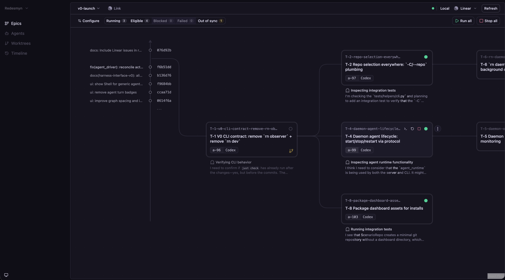

# Redesmyn

## Summary

Redesmyn is a local-first, remote-aspirational GUI + CLI for orchestrating multi-agent work on a git repository. It models work as an **epic-scoped task graph** where each task corresponds to a branch + worktree. Graph edges represent **merge sequencing** (what should land before what). A series of connections represents a **stack**. The dashboard is a realtime view + control surface for that graph.

Ticket hierarchies generally treat edges as composition (“part of”). Redesmyn uses edges for **sequencing** (“must land before”). The graph gives you a bird's eye view of a bespoke code production line, showing work along both the **agent execution** dimension and the **merge/product** dimension (changes landing on the base). 

This project is not yet intended for public use (or stability), but it may still be interesting if you’re exploring agent-oriented engineering workflows.

Feature overview:

- A graph-native UI for understanding merge readiness, conflicts, and agent activity.
- Per-task agent sessions (tmux-first) with a configurable agent command + prelude, so you can run many task-bound agents without juggling many separate chat threads (and quickly attach to any session when you want to).
- A CLI (`rn`) that shares the same core operations as the dashboard (API/DB/git mechanics), though the GUI has received more attention so far.
- Worktree-aware git operations (merge, restack, merge and restack) with safety checks.
- Explicit sync between Markdown task docs and the local DB.
- Integrations (currently Linear) to align external tickets with the local graph.

Limitations (today):

- Early-stage and opinionated; local single-user usage is the happy path.
- “Distributed mode” (remote executors / control plane separation) is a work in progress.
- Agent capability semantics (turn detection, richer status, adapters) are still being formalized.
- Git state + concurrency can be sharp; conflicts are expected to require manual resolution.
- Sandboxing is best-effort (primarily a safety rail against accidental writes), not a hardened security boundary.
- Task docs use a nonstandard Markdown spec; creating tasks is ergonomic via Linear sync or by asking an agent, but manual authoring is still rough.
- There is not yet a dedicated “Redesmyn skill” for agents; in practice you give an agent a short primer once (how tasks map to branches, and how to run/attach/merge/restack).
- The CLI is functional and shares core logic with the GUI, but has not received as much product/UX attention yet.
- There is no “cascading” execution yet: marking an upstream task complete/ready does not automatically start downstream agents.
- Sync is manual/explicit by default; optional autosync configurations are not yet available.
- Packaging/installation/running are not yet ergonomic outside this repository (dev-first setup).

## Currently moving

- **Agent interface**: unifying multiple agent programs and multiple execution modes (interactive vs exec). Exec mode unlocks reliable output parsing for display in the frontend and for cross-agent communication, so users can use one chat/control surface to steer many task-bound agents. Communication also enables assisted/automatic conflict resolution during restack.
- **Packaging + architecture**: making it easier to install/run outside this repo, and reducing “split brain” between control-plane concerns and repo-local execution.
- **Polish + usability**: tightening the dashboard’s core loops (merge/restack, conflicts, selection/viewport behavior, configuration surfaces) so daily dogfooding feels reliable.

## Feature guide (and current state)

- **Development (single-origin dev loop)** — *Works.*
  - Prereqs: Python 3.11+, Node `22.12.0` (`.nvmrc`), `uv` (`brew install uv`), optional `hk` (`brew install hk`).
  - Run dashboard HMR + daemon reload: `just dev`.
  - One-time hooks: `just hooks` (or `hk install`).
  - Install + init: `just install`, then `rn init`.
- **Packaging / install** — *Not yet ergonomic.* Primarily designed to run from a source checkout (this repo), with a moving architecture and dev-first defaults.
- **Dashboard (React/Vite)** — *Works.* `dashboard/README.md`.
- **CLI** — *Works; evolving.* Primary entrypoints include `rn init`, `rn sync`, `rn merge`, `rn restack`.
- **Git operations** — *Works; still sharp.* “Merge”, “Merge and Restack”, and “Merge then Restack” are intended to keep stacked branches coherent across worktrees; conflicts require manual resolution.
- **Agent sessions** — *Works; contract in flux.* Task-scoped sessions with attach/log affordances; structured exec output + cross-agent communication are key unlocks in progress.
- **Sandbox (agent sessions)** — *Best-effort; macOS-only today.* Optional “worktree sandbox” denies writes outside the worktree (plus required shared state like `.git`/temp) and can optionally deny all network; it still allows broad reads and may break some tools.
- **Sync (docs ↔ DB)** — *Works; manual by default.* Today sync is explicit; autosync options are a planned improvement.
- **Linear integration** — *Works for explicit sync; incomplete.* Expect gaps, schema churn, and occasional endpoint/API mismatches.
- **OpenAPI** — *Internal; subject to change.* `openapi/openapi.json`.
- **Issue scratchpad** — *Temporary.* `ISSUES.md`.
